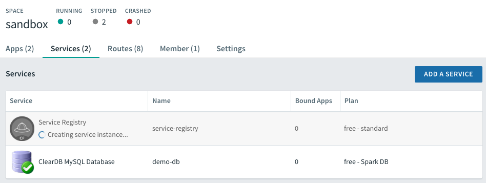
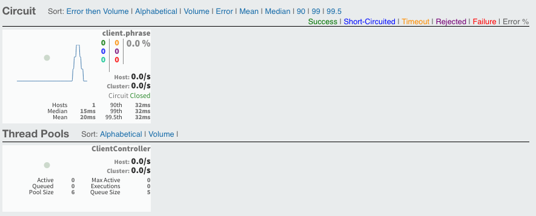
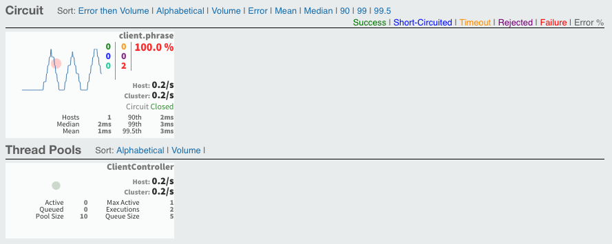

= PACE Enterprise Microservices with Spring Cloud Workshop

The purpose of this workshop is demonstrate how Spring Cloud can help developers create robust cloud native microservice applications.

== Spring Cloud Circuit Breaker

. Check out the https://github.com/Pivotal-Field-Engineering/pace-cloud-native-workshop/tree/spring-cloud-circuit-breaker[sample project].

. If it doesn't already exist, create the `service-registry` Spring Cloud Service Registry instance in PWS.

+
[source,bash]
----
cf create-service p-service-registry standard service-registry
----

+
You can observe the instance being created from the Apps Manager in PWS.

+

+

. Create the Circuit Breaker Dashboard service instance in PWS.

+
[source,bash]
----
cf create-service p-circuit-breaker-dashboard standard circuit-breaker-dashboard
----

+
NOTE: Wait for both services to be created before pushing any apps.

. Build both the `client` and `sb-basic-demo` apps.

+
[source,bash]
----
mvn clean package -DskipTests
----

. Push the `sb-basic-demo` and `client` apps.

. In a browser, hit the home URL of the client app a few times (refresh the page).  Make sure it shows the text `Greeting language is English.`

. In the Apps Manager, navigate to the list of services, select the `Circuit Breaker Dashboard`, and click the manage button in the upper right corner.

+

+
Note that the circuit should show `Closed` at this time.

. Stop the `sb-basic-demo` app.

+
[source,bash]
----
cf stop sb-basic-demo
----

+
Now go back and try to hit the URL of the client app.  You should now see `Greeting Language is gibberish!!`, with the number of service call failures in red on the dashboard.

+

+
The service is unreachable, so the default message is shown.
