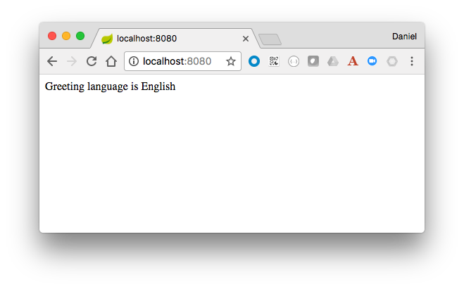
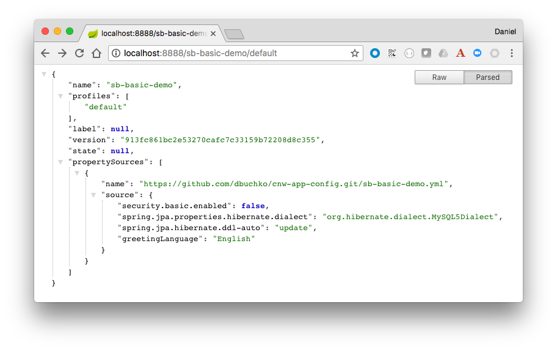
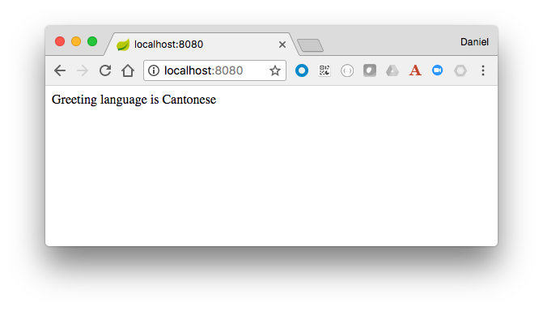
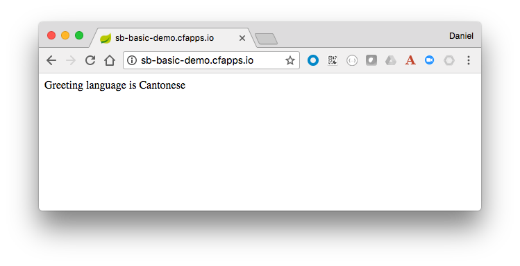

= PACE Enterprise Microservices with Spring Cloud Workshop

The purpose of this workshop is demonstrate how Spring Cloud can help developers create robust cloud native microservice applications.

== Spring Cloud Config Server

=== Configure and Start a Local Config Server

. In your Github account, create a public repository to hold the application configuration properties.

. Check out the https://github.com/Pivotal-Field-Engineering/pace-cloud-native-workshop/tree/spring-cloud-config-server[sample project].

. Open the `application.yml` in the `config-server/src/main/resources` directory of the Pace Cloud Native Workshop repository, and change the `spring.cloud.config.server.git.uri` to point to the new repository you just created above.

. In a command window, build and run the local config server. Leave it running for the duration of the demo:

+
[source,bash]
----
mvn clean package -DskipTests spring-boot:run
----

=== Create the Config Server Client

. Change to the `sb-basic-demo` directory, build and run the application to verify it is working correctly locally.

+
[source,bash]
----
mvn clean package -DskipTests spring-boot:run
----

. Hit http://localhost:8080 and verify you are seeing the correct greeting language, which should be English.

+

. Examine the `application.yml` properties file, it should contain the following content.

+
.application.yml
[source,yaml]
----
security:
  basic:
    enabled: false

management:
  security:
    enabled: false

spring:
  jpa:
    properties:
      hibernate:
        dialect: org.hibernate.dialect.MySQL5Dialect
    hibernate:
      ddl-auto: update

greetingLanguage: English
---
spring:
  profiles: dev
greetingLanguage: French
---
spring:
  profiles: prod
greetingLanguage: Spanish
----

. Note the following dependency that's been added to the `pom.xml` file.

+
.pom.xml
[source,xml]
----
.
.
.
	<dependencyManagement>
		<dependencies>
			<dependency>
				<groupId>io.pivotal.spring.cloud</groupId>
				<artifactId>spring-cloud-services-dependencies</artifactId>
				<version>1.6.0.RELEASE</version>
				<type>pom</type>
				<scope>import</scope>
			</dependency>
			<dependency>
				<groupId>org.springframework.cloud</groupId>
				<artifactId>spring-cloud-dependencies</artifactId>
				<version>Edgware.RELEASE</version>
				<type>pom</type>
				<scope>import</scope>
			</dependency>
		</dependencies>
	</dependencyManagement>

<dependencies>
    .
    .
    .
		<dependency>
			<groupId>io.pivotal.spring.cloud</groupId>
			<artifactId>spring-cloud-services-starter-config-client</artifactId>
		</dependency>
</dependencies>
----

. Create a new `src/main/resources/bootstrap.yml` file with the following contents:

+
.bootstrap.yml
[source,yaml]
----
spring:
  application:
    name: sb-basic-demo
----

. In your github repository root directory, create a `sb-basic-demo.yml` file, and _move_ all the properties from the `application.yml` file into it:

+
.sb-basic-demo.yml
[source,yaml]
----
security:
  basic:
    enabled: false

management:
  security:
    enabled: false

spring:
  jpa:
    properties:
      hibernate:
        dialect: org.hibernate.dialect.MySQL5Dialect
    hibernate:
      ddl-auto: update

greetingLanguage: English
---
spring:
  profiles: dev
greetingLanguage: French
---
spring:
  profiles: prod
greetingLanguage: Spanish
----

+
Your `application.yml` file should now be empty.

. In a browser, navigate to the local Config Server endpoint for the application properties, http://localhost:8888/sb-basic-demo/default[http://localhost:8888/sb-basic-demo/default], to verify the properties are now being read from the Github repository.

+

+
Also, note that only the default profile settings are shown.  To see the other profile settings for the greeting, try hitting the other endpoints:  http://localhost:8888/sb-basic-demo/dev[http://localhost:8888/sb-basic-demo/dev] and http://localhost:8888/sb-basic-demo/prod[http://localhost:8888/sb-basic-demo/prod].

+
NOTE:  It's also possible to extract each profile into a separate file and store them in the Github repository. Spring Config Server will automatically look for files following the naming convention `<app-name>-<profile>.yml` (eg. `sb-basic-demo-dev.yml`).

. Build and launch the `sb-basic-demo` client app.

+
[source,bash]
----
mvn clean package -DskipTests spring-boot:run
----

+
Hit the app endpoint http://localhost:8080[http://localhost:8080], verify that you see the same greeting language of English as before.

. Now let's demonstrate how the application properties can be updated without restarting our application.

+
Add the `@RefreshScope` annotation to our app so that we can tell it to refresh the properties if we update them.  Open the `SBController` app, and add the annotation to the class.

+
.SBController.java
[source,java]
----
package io.pivotal.pace;

import java.util.List;

import org.springframework.beans.factory.annotation.Value;
import org.springframework.cloud.context.config.annotation.RefreshScope;
import org.springframework.web.bind.annotation.RequestMapping;
import org.springframework.web.bind.annotation.RestController;

@RestController
@RefreshScope
public class SBController {

	private GreetingRepository greetingRepository;

	@Value("${greetingLanguage}")
	private String language;

	public SBController(GreetingRepository greetingRepository) {
		this.greetingRepository = greetingRepository;
	}

	@RequestMapping("/")
	public String greetingLanguage() {
		return "Greeting language is " + language;
	}

	@RequestMapping("/greeting")
	public String greeting() {
		List<Greeting> greeting = greetingRepository.findByLanguage(language);
		if (greeting.isEmpty())
			return "Greeting not found for " + language;
		else
			return greeting.get(0).getText();
	}
}
----

. Rebuild and restart the application.  Verify the greeting is still `English` on the root URL of the app, http://localhost:8080[http://localhost:8080].

. In your Github repository, edit the `sb-basic-demo.yml` file and change the default greeting to `Cantonese`.  Commit the change.

. Refresh the page of the app, it should still show `English`.

. Post to http://localhost:8080/refresh[http://localhost:8080/refresh], to re-load the values from the config server.

+
[source,bash]
----
curl -X POST http://localhost:8080/refresh
----

+
Now reload the home page, you should see the new language value of `Cantonese`.

+

=== Use Spring Cloud Services Config Server in PCF

Now that we've seen how the config server works locally, let's deploy the app to PWS and use the SCS config server.

. Package the application for deployment to PCF.

+
[source,bash]
----
mvn clean package
----

. Edit the `manifest.yml` and change the hostname of the route to make it unique.

. Push the app to PWS without starting it.

+
[source,bash]
----
cf push
----

. Create the config server service instance, substituting your repository URL accordingly.

+
[source,bash]
----
cf create-service -c '{"git": { "uri": "https://github.com/<my-repo>/cnw-app-config" }, "count": 2 }' p-config-server standard config-server
----

+
Check the status of the service by running the `cf service config-server` command, wait until it has completed.

. Bind the service to the app.

+
[source,bash]
----
cf bind-service sb-basic-demo config-server
----

. Start the app, and hit the endpoint to see that it is picking up the configuration from the config server.

+

